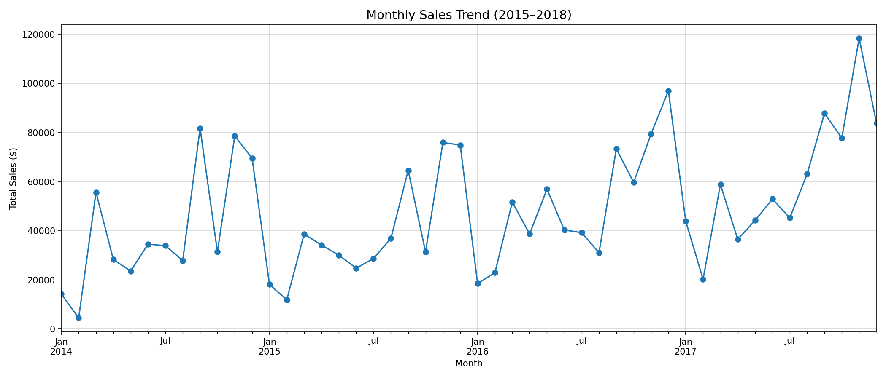
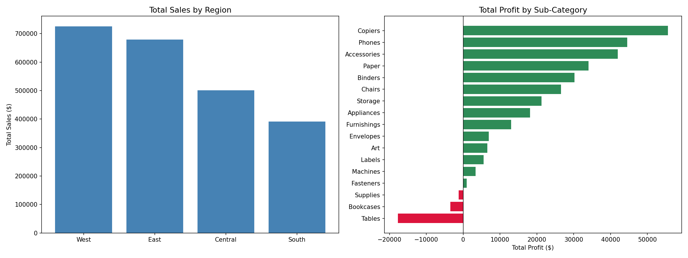
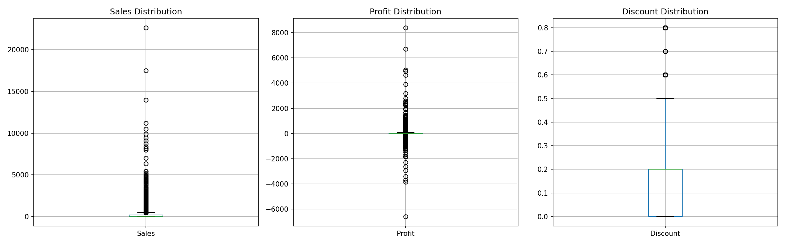
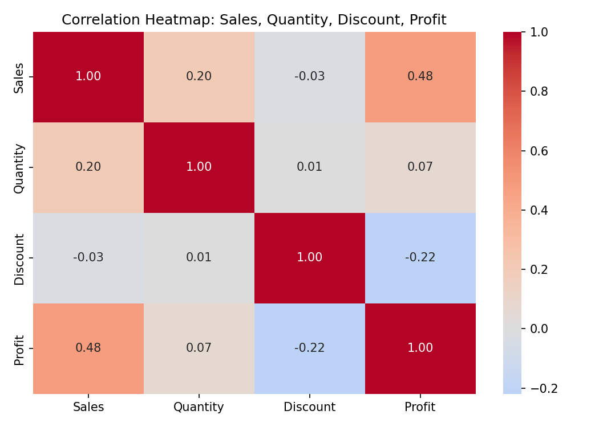
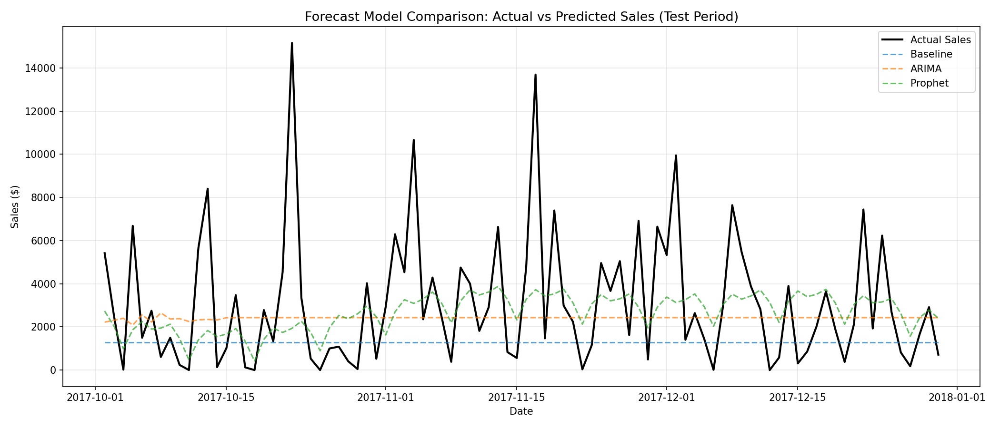
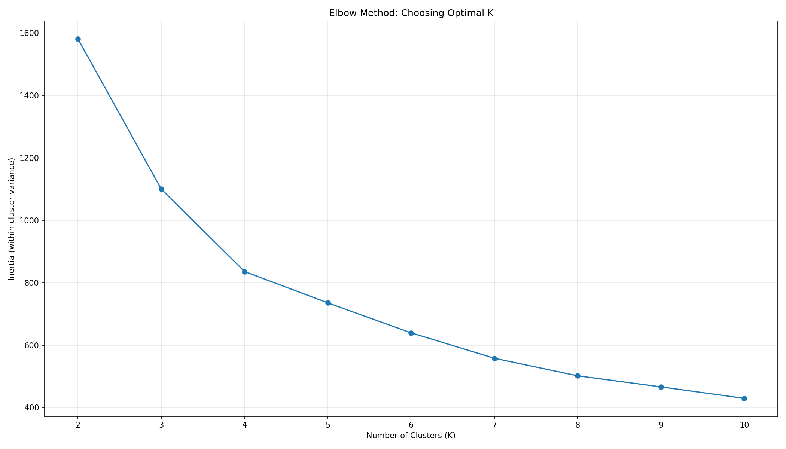
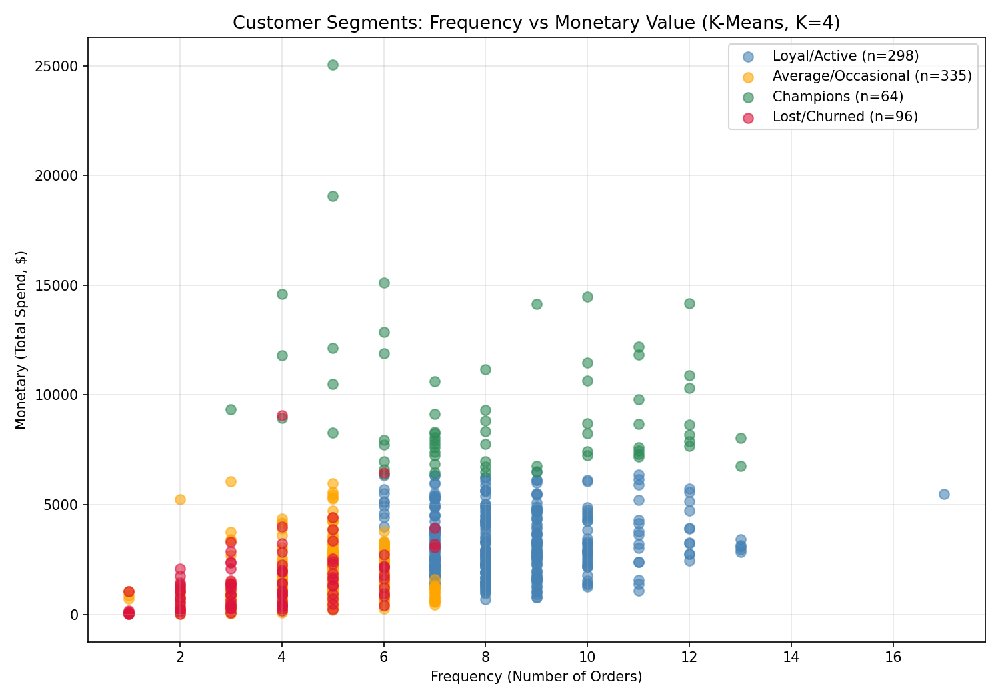

# Retail Sales Analytics & Demand Forecasting

End-to-end retail analytics project using **SQL, Python, and Power BI** on the Superstore dataset — covering data analysis, customer segmentation, demand forecasting, and interactive dashboarding.

🚧 **Project Status: In Progress** — SQL analysis and Python analysis (EDA, forecasting, segmentation) complete. Power BI dashboard coming next.

---

## 📊 Project Overview

This project analyzes retail sales data to uncover business insights around profitability, customer behavior, and regional performance — then builds predictive models for demand forecasting and customer segmentation.

**Dataset:** [Sample Superstore](https://www.kaggle.com/datasets/vivek468/superstore-dataset-final) (Kaggle) — 9,994 orders across Furniture, Office Supplies, and Technology categories (2014–2017).

**Tech Stack:** MySQL · Python (pandas, matplotlib, seaborn, pmdarima/ARIMA, Prophet, scikit-learn) · Power BI

---

## ✅ Phase 1: SQL Analysis

Located in [`/sql`](./sql/01_sql_analysis.sql)

Covers: aggregations, filtering, date functions, window functions (RANK, ROW_NUMBER, LAG), CTEs, and RFM customer segmentation.

### Key Insights

**Regional Profitability**
- West region leads in both sales ($725K) and profit margin (14.94%)
- Central region ranks #2 in sales but has the lowest margin (7.92%) — traced to Furniture sub-categories

**Loss-Making Product Lines**
- Tables: -8.56% margin (-$17.7K total loss) — biggest loss driver
- Bookcases: -3.02% margin
- Best performers: Copiers (37.2% margin), Labels (44.4% margin)

**Customer Segmentation (RFM Analysis)**
- Champions (109 customers): highest per-customer value at $5,249 avg spend
- "Needs Attention" (295 customers): largest segment by volume, contributing $923K total
- "At Risk" customers (60): still high-value ($4,231 avg spend) — priority for retention efforts

---

## ✅ Phase 2: Python Analysis (EDA, Forecasting, Segmentation)

Located in [`/python`](./python/02_analysis_and_forecasting.ipynb) | Exported data in [`/data`](./data)

### 2.1 Exploratory Data Analysis

**Sales Trend & Seasonality**
- Clear year-over-year growth in total sales (2014–2017)
- Strong seasonal pattern: sales spike sharply in Nov/Dec (holiday season), followed by a January dip



**Category & Region Performance** — confirmed SQL findings visually



**Discount → Profit Investigation**
- Initial hypothesis (extreme 50%+ discounts driving Furniture losses) was tested and **revised** based on evidence
- Real driver: **widespread moderate discounting** — Tables (26% avg discount, 77% of orders discounted) and Bookcases (21% avg discount, 74% of orders discounted) operate on thin margins that can't absorb even moderate discounts
- Overall Discount–Profit correlation is weak (-0.22), but the effect is **highly category-specific** — high-margin categories (Copiers, Labels) absorb discounts easily; low-margin categories (Tables, Bookcases) do not




**Business Recommendation:** Cap discounts on Tables/Bookcases below ~15%, or review base pricing — current discount levels are structurally unprofitable for these sub-categories.

---

### 2.2 Demand Forecasting

Built and compared three forecasting models on daily sales data, holding out the final 90 days (including the Nov/Dec holiday season) as a test set.

| Model | RMSE | MAE |
|---|---|---|
| Baseline (flat average) | $3,504.16 | $2,363.99 |
| ARIMA (weekly seasonality) | $3,083.23 | $2,215.05 |
| **Prophet (weekly + yearly seasonality)** | **$2,869.22** | **$2,025.99** |

**Prophet performed best**, improving RMSE by ~18% over the baseline. This matches the seasonality pattern identified in EDA — Prophet's ability to explicitly model yearly holiday seasonality (unlike ARIMA, which was limited to weekly patterns) gave it an edge in predicting the holiday-season test period.



---

### 2.3 Customer Segmentation (K-Means Clustering)

Applied K-Means clustering (K=4, chosen via Elbow Method) on scaled RFM features, to independently validate the SQL-based RFM segmentation using unsupervised machine learning.



| Cluster | Customers | Avg Recency | Avg Frequency | Avg Monetary | Label |
|---|---|---|---|---|---|
| 2 | 64 | 123.7 days | 8.3 | $9,479.5 | Champions |
| 0 | 298 | 72.7 days | 8.5 | $3,322.2 | Loyal/Active |
| 1 | 335 | 101.2 days | 4.7 | $1,669.7 | Average/Occasional |
| 3 | 96 | 559.5 days | 3.7 | $1,470.2 | Lost/Churned |



**Validation finding:** K-Means independently confirmed the broad structure of the SQL RFM segmentation — a small high-value "Champions" tier, a large mid-tier group, and a distinct "Lost/Churned" tier — confirming these patterns reflect real underlying customer behavior. K-Means identified a smaller, higher-value Champions group ($9,479 avg) than the SQL NTILE approach ($5,249 avg), suggesting the SQL method may be more generous in labeling top-tier customers.

---

## 🔜 Coming Next

- [x] Phase 1: SQL Analysis
- [x] Phase 2: Python EDA
- [x] Phase 2: Demand Forecasting (ARIMA, Prophet)
- [x] Phase 2: Customer Segmentation (K-Means)
- [ ] Phase 3: Power BI interactive dashboard
- [ ] Phase 4: Full case study write-up

---

## 📁 Repo Structure
\```
/sql
   01_sql_analysis.sql
/python
   02_analysis_and_forecasting.ipynb
   [chart images]
/data
   superstore_cleaned.csv
   daily_forecast_results.csv
   customer_segments.csv
\```
